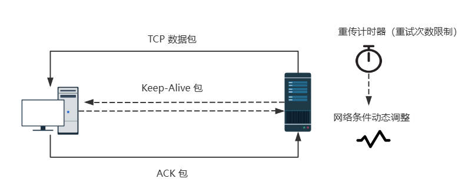

# Lesson 1: 理解 React，搭建源码工程 🥳


”在浏览网页时，用户希望页面的内容能够**快速加载**且**流畅交互**。” —— 这是 web 技术发展的两个重要目标。

<br>

## 1、课程导入与背景介绍

导致 Web 性能问题的原因主要有两种：
- 网络延迟。
- 浏览器的单线程特性。

减少网络延迟，或者说提高网站加载速度，可以让用户尽快获取所需信息。

在浏览器的单线程特性下，我们希望可以尽可能减少主线程的任务，以确保渲染流畅，并且对用户交互的即时响应。

<br>

### 网络请求过程
---
<br>

为了更好地解决网络延迟的优化问题，我们需要先理解整个网络请求和响应过程：

- DNS 查询


上面是 DNS 查询过程的简略图，可以看到，移动用户数据往返都是通过基站，DNS 查询可能存在性能问题。

- TCP 握手
  - 网络层：IP（提供设备间通信的能力，IPv4、IPv6，绑定 IP 逻辑地址与 MAC 地址）
  - 传输层：TCP（保证通信可靠性）、UDP（提供快速传输）
  - 应用层：HTTP、FTP、SMTP、WebSocket（提供具体应用功能）


- TCP 的“三次握手”是建立一个可靠连接的过程  
  - SYN：客户端向服务器发送一个 SYN 报文，告诉服务器自己的初始序列号。
  - SYN-ACK：服务器收到客户端的 SYN 报文后，响应一个 SYN-ACK 报文段，其中含有自己的初始序列号。
  - ACK：客户端收到服务器的 SYN-ACK 报文后，向服务器发送一个 ACK 报文段，同时带上对服务器 ACK 的确认。

  ```text
  客户端                               服务器
    | ----------- SYN (seq=X) --------> |  （第一次握手，SYN_SENT）
    | <------- SYN-ACK (seq=Y, ack=X+1) |  （第二次握手，SYN_RCVD）
    | ---------- ACK (ack=Y+1) -------> |  （第三次握手，ESTABLISHED）


  seq，即序列号（Sequence Number）
  ask，即确认号（Acknowledgment Number）
  ```


- TLS 协商（即TLS 握手）

  对于通过 HTTPS 建立的安全连接，还需要另外的 TLS 握手。

  ```text
  客户端                               服务器
    | -------------- 客户端 Hello -------------> |  (支持的 TLS 版本、支持的加密算法、client_random 随机数)
    | <------- 服务器 Hello + 服务器证书和密钥交换 | （server_random 随机数、CA证书、密钥交换参数）
    | -------------- 客户端密钥交换 ------------> | （用 CA 证书生成 pre-master secret，及预主密钥，及两者随机数，生成会话密钥）
    | <------------- 服务器 Finished ----------- | （加密的 Finished 消息）
    | -------------- 客户端 Finished ----------> | （加密的 Finished 消息）
  ```

- 响应

  握手完成后，浏览器正式向服务器端发送一个 HTTP(S) 请求，通常回事一个 GET 请求以获得 HTML 文件。  
  在传输过程中，TCP 包被分割成段。由于 TCP 保证了数据包的顺序，因此服务器在发送一定数量的分段后，必须从客户端接收一个 ACK 包的确认。

  

  TCP协议通过以下机制保证数据的可靠性和完整性：
  - 重传机制
  - 拥塞控制机制
  - 连接终止


<br>

### 浏览器解释和渲染

---
<br>

 


xxxxxxxxxx import { createRoot } from 'mini-react-dom/client'​const element = document.createElement('div')element.innerText = 'Hello, Mini React DOM!'​createRoot(document.getElementById('root')!).render(element)ts
- DOM、CSSOM 、执行脚本、滚动、触摸和其它交互操作都在主线程上执行。
- 如果主线程忙于执行脚本或者渲染工作，那么就无法及时响应用户的交互操作。
- 可以利用 Worker 线程来执行耗时的计算任务，以避免阻塞主线程。
- 可将内容提升到 GPU 上的层，利用 GPU 线程来提高绘制和重新绘制性能，减轻主线程负担。

<br>

### Javascript 事件循环和性能的关系
---

 

从上面的图可以看到，微任务的执行先于渲染，宏任务则在其后。所以对于微任务和宏任务需要注意：

- 避免滥用微任务，否则会阻塞主线程，卡帧。
- 合理拆分宏任务，避免大量宏任务积压，否则会延迟其他任务执行。

 <br>

### 引入 React
---
<br>

从上面的图解可以知道，所有的 DOM 操作和页面渲染都在主线程上执行，从而影响用户交互的流畅性。

传统方式下，直接操作 DOM 有下面的缺点：
- 页面更新性能问题（频繁的 DOM 操作会触发重排和重绘）。
- 手动管理状态、事件绑定复杂。
- 缺少组件化思想，代码复用性低。

引入 React 的优势：
- 虚拟 DOM 提高性能。
- 组件化开发，提高代码复用性。
- 声明式编程，简化 UI 状态管理。

<br>

## 2、课程预期目标

✅ 理解 React 的核心概念和原理。

✅ 搭建 mini-react 源码工程，为后续的源码剖析做准备。

<br>

## 3、核心概念与原理分析

在搭建源码工程之前，我们需要先理解 React 的核心概念和原理。

React 核心原理：

 - 虚拟 DOM
 - 调和（Reconciliation）
 - [声明式编程](./code/a.jsx) vs [命令式编程](./code/a.html)

<br>

React 的初始化渲染过程：

 

### 关键点总结
1、虚拟 DOM 提供了 UI 的抽象描述。  
2、调和算法比较虚拟 DOM 树的差异。  
3、Fiber 树提供高性能、可中断的更新机制。  
4、Commit 阶段将更新应用到实际 DOM，完成页面渲染。  

<br>

## 4、React源码结构概览 

React 源码 Github 地址：https://github.com/facebook/react/tree/v18.3.1

源码目录结构介绍：

```text
react
├── fixtures // 示例代码和测试用例
├── scripts  // 构建、测试和发布的脚本
└── packages // 有核心模块，每个子目录对应一个独立的包，可以单独发布到 npm。
    ├── react     // React 的核心库
    ├── react-dom // 面向浏览器的渲染逻辑，包括 DOM 操作
    ├── scheduler // React 的任务调度器，管理任务优先级和执行时机
    ├── react-reconciler // React 的调和算法实现，负责对比虚拟 DOM 和更新 Fiber 树
    ├── react-server // 用于服务器渲染
    ├── shared // 共享的内部工具和常量
    └── 其它的工具子包和测试模块
```

<br>

## 5、🌟 搭建源码工程 🌟

为了更好地理解 React 的源码，我们需要搭建一个 mini-react 源码工程。

从 React 17 开始，React 官方库将核心功能和 DOM 渲染功能明确分离为两个独立的模块：react 和 react-dom。

- `react` 包含 React 的核心逻辑，例如组件定义、状态管理、Hooks 等。

- `react-dom` 专注于将 React 组件渲染到 DOM 中（仅限于 Web 环境）。这也是为了跨平台的考虑。

为此，我们需求搭建一个常规的前端项目用于普通的 React 开发，以及下面两个 npm 包项目项用于简单实现 React 的基础功能：

- `mini-react`

- `mini-react-dom` 

由于这里需要同时开发和关联多个项目，使用 Monorepo（Monolithic Repository，整体式项目）管理项目会比简单地 `npm link` 方式有更多好处。而 pnpm workspaces 就是其中一个 Node.js 项目轻量级的 Monorepo 解决方案，适合简单场景。所以我们整个项目将使用 pnpm 进行管理。

步骤很简单，我们需要创建如下目录结构：

```text
monorepo
├── playground
├── packages
│     ├── mini-react
│     └── mini-react-dom
├── pnpm-workspace.yaml
└── README.md
```

配置 pnpm-workspace.yaml，定义子包的位置：
```yaml
packages:
  - "packages/*"
  - "playground"
```

由于希望可以在根目录下运行所有包的 script dev 脚本，和添加 commitizen 规范化提交信息工具，我们需要在根目录执行：
```bash
pnpm init

pnpm add -D commitizen @commitlint/config-conventional @commitlint/cli -w
```
可以看到，这里使用了 -w（--workspace-root）参数。因为 pnpm 默认会认为你不应该将依赖直接添加到 workspace 根目录，因为这样可能会导致依赖污染整个 monorepo 的结构。

根目录添加 commitlint.config.js：
```js
export default {
	extends: ['@commitlint/config-conventional'],
}
```
> https://www.npmjs.com/package/@commitlint/config-conventional

在 package.json 中添加如下内容：
```json
{
  "config": {
		"commitizen": {
			"path": "cz-conventional-changelog"
		}
	},
  "scripts": {
    "dev": "pnpm -r --parallel run dev",
    "commitAll": "git add . && git-cz",
  },
}
```
最后是添加一个 `.gitignore` 文件。可以通过 https://www.toptal.com/developers/gitignore 创建适合自己的 `.gitignore` 文件。

在提交之前，我们可以在根目录添加一个 README.md 文档，以描述这个整体式项目是什么用途的，这是一个好习惯。

接下来是单独的子项目构建，为了减少他们之间维护和互相兼容的复杂性，他们将以相对独立的方式进行创建。详见：

- [playground 项目工程搭建](playground.md)
- [mini-react npm 包项目工程搭建](mini-react.md)

<br>

## 6、课程回顾与总结  

知识点回顾：
- 了解网络请求和响应过程，以及浏览器的解释和渲染过程。
- 从传统开发模式到 React 的核心原理。
- React 的虚拟 DOM 和 Fiber 架构的基础概念。
- 如何搭建 mini-react 源码项目的基本环境。

学员成果：
- 完成了 mini-react 项目的初始搭建，为后续的源码剖析奠定了基础。

<br>

## 7、附加资源

- React 源码 Github 地址：https://github.com/facebook/react/tree/v18.3.1
- React 官方文档：https://zh-hans.react.dev/
- React 18 官方文档：https://18.react.dev/
- React GitHub 仓库（Fiber 核心代码）：https://github.com/facebook/react/tree/main/packages/react-reconciler
- React Fiber 架构详解（GitHub， 由 React 核心开发者 Andrew Clark 编写，系统地介绍了 Fiber 的设计目标和实现思路。）：https://github.com/acdlite/react-fiber-architecture
- MDN web 文档，渲染页面：浏览器的工作原理：https://developer.mozilla.org/zh-CN/docs/Web/Performance/How_browsers_work

<br>

## 8、问题解答

- [😕：“虚拟 DOM 是如何优化性能的？”](./qa/qa1.md)。
- [😕：“你是否了解调和算法的工作原理？”](./qa/qa2.md)。
- [😕：“Fiber 是链表还是树？”](./qa/qa3.md)。
- [😕：“怎么理解 Fiber 实现深度优先遍历新旧虚拟 DOM 树？”](./qa/qa4.md)。

👉 对本课程有任何疑问的朋友，欢迎在评论区提问和交流。