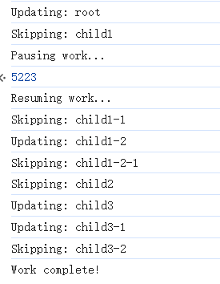

# 😕：“怎么理解 Fiber 实现深度优先遍历新旧虚拟 DOM 树？”

<br>

## 1、Fiber 将树结构转化为链表后，仍会遍历所有节点，但会遵循调和算法的三个原则

即使 React 的 Fiber 架构将树结构转化为链表结构，它依然会遍历所有的节点，这是 React 调和算法的重要部分。Fiber 的深度优先遍历在传统树遍历的基础上，结合链表结构，进一步优化了遍历逻辑。

<br>

## 2、传统的深度优先遍历

在传统的虚拟 DOM 中，深度优先遍历按照以下步骤进行：  

- **访问当前节点**。  

- **递归遍历子节点**（从左到右）。  

- **回溯到父节点**，继续处理兄弟节点。  

### 缺点：
- **无法中断**：必须完整遍历整棵树。
- **递归实现**：如果组件树非常深，可能导致栈溢出或性能问题。

<br>

## 3、Fiber 架构下的深度优先遍历

### Fiber 遍历的特点

**可中断**：
   - Fiber 使用链表结构取代树的递归操作，每个节点包含对 `child`、`sibling` 和 `return`（父节点）的引用。
   - 允许在必要时暂停遍历，优先处理更紧急的任务（如用户输入或动画）。

**按需遍历**：
   - React 仅更新需要变更的分支，而不是重新构建整个树。

**遍历顺序**：
   - Fiber 依然遵循深度优先顺序：
     - 从根节点开始，优先访问子节点。
     - 访问兄弟节点，最后回溯到父节点。
   - 通过链表指针实现，不需要递归调用。

<br>

## 4、Fiber 节点结构

Fiber 节点是一个轻量级对象，包含以下指针：
- `child`：指向第一个子节点。
- `sibling`：指向下一个兄弟节点。
- `return`：指向父节点。

### 遍历过程
1、从根节点开始，访问当前节点。  
2、如果有子节点，则进入子节点。  
3、如果没有子节点，则回溯到父节点，访问兄弟节点。  
4、如果既没有子节点也没有兄弟节点，则继续回溯，直到遍历完整棵树。  

<br>

## 5、示例代码：Fiber 的遍历逻辑

### 创建示例 Fiber 树

```javascript
// 示例 Fiber 树
const fiberTree = {
  name: "root",
  flags: "update", // 根节点需要更新
  child: {
    name: "child1",
    flags: null, // 不需要更新
    child: {
      name: "child1-1",
      flags: null, // 不需要更新
      child: null,
      sibling: {
        name: "child1-2",
        flags: "update", // 此节点需要更新
        child: {
          name: "child1-2-1",
          flags: null, // 不需要更新
          child: null,
          sibling: null,
          return: null, // 将在构造时设置
        },
        sibling: null,
        return: null, // 将在构造时设置
      },
      return: null, // 将在构造时设置
    },
    sibling: {
      name: "child2",
      flags: null, // 不需要更新
      child: null,
      sibling: {
        name: "child3",
        flags: "update", // 此节点需要更新
        child: {
          name: "child3-1",
          flags: "update", // 此节点需要更新
          child: null,
          sibling: {
            name: "child3-2",
            flags: null, // 不需要更新
            child: null,
            sibling: null,
            return: null, // 将在构造时设置
          },
          return: null, // 将在构造时设置
        },
        sibling: null,
        return: null, // 将在构造时设置
      },
      return: null, // 将在构造时设置
    },
    return: null, // 将在构造时设置
  },
  sibling: null,
  return: null,
};


function setReturnPointers(fiber, parent = null) {
  if (!fiber) return;
  fiber.return = parent;

  if (fiber.child) {
    setReturnPointers(fiber.child, fiber);
  }
  if (fiber.sibling) {
    setReturnPointers(fiber.sibling, parent);
  }
}

// 初始化 Fiber 树的 return 属性
setReturnPointers(fiberTree);
```
### 模拟 Fiber 遍历
以下代码展示了 Fiber 遍历中如何暂停和恢复。
```javascript
let nextUnitOfWork = null; // 下一个工作单元
let isPaused = false; // 模拟暂停标志

// 模拟 performWork 方法
function performWork(fiber) {
   // 检查当前节点是否需要更新
  if (fiber.flags === "update") {
    console.log(`Updating: ${fiber.name}`);
  } else {
    console.log(`Skipping: ${fiber.name}`);
  }
  // 优先返回子节点作为下一个工作单元
  if (fiber.child) {
    return fiber.child;
  }

  // 如果没有子节点，访问兄弟节点或回溯父节点寻找兄弟节点
  let nextFiber = fiber;
  while (nextFiber) {
    if (nextFiber.sibling) {
      return nextFiber.sibling;
    }
    nextFiber = nextFiber.return; // 回溯到父节点
  }

  return null; // 全部遍历完成
}

// 模拟时间切片，暂停任务
function workLoop() {
  while (nextUnitOfWork && !isPaused) {
    nextUnitOfWork = performWork(nextUnitOfWork);

    // 模拟某些条件下的暂停
    if (nextUnitOfWork?.name === "child1-1") {
      console.log("Pausing work...");
      isPaused = true;
    }
  }

  if (!nextUnitOfWork) {
    console.log("Work complete!");
  }
}

// 开始任务
function startWork() {
  nextUnitOfWork = fiberTree; // 从根节点开始
  workLoop();
}

// 恢复任务
function resumeWork() {
  console.log("Resuming work...");
  isPaused = false;
  workLoop();
}

// 执行代码
startWork(); // 启动 Fiber 遍历
setTimeout(() => resumeWork(), 2000); // 2 秒后恢复任务
```

```text
root
├── child1
│   ├── child1-1
│   └── child1-2
│       └── child1-2-1
├── child2
└── child3
    ├── child3-1
    └── child3-2
```

输出：



<br>

## 6. 总结

虽然 Fiber 使用链表结构优化了深度优先遍历，但其本质仍然是遍历所有节点。区别在于：

- **遍历过程可中断**：Fiber 能够暂停和恢复遍历。  
- **动态优先级调整**：根据任务的重要性动态调整遍历顺序。

这种特性让 React 在性能和用户交互体验之间找到平衡，为复杂用户界面提供更高的响应能力。

<br>

## React 中的真实场景

当状态或属性发生变化时，React 不会直接从根节点开始遍历整个虚拟 DOM 树，而是采用了一种高效的 **"调和" (reconciliation)** 机制。以下是具体的工作原理：

### 1. 从受影响的组件开始更新
当状态或属性发生变化时，React 知道是哪个组件的状态或属性发生了变化。它会从**该组件**开始重新渲染虚拟 DOM 树，而不是从整个根节点开始。

- 如果是某个组件的 `state` 发生了变化，React 会以这个组件为起点，重新计算它及其子组件的虚拟 DOM。
- 如果是父组件的 `props` 发生了变化，其子组件会因接收到新的 `props` 而被重新渲染。

<br>

### 2. 比较新旧虚拟 DOM
React 使用 **Diff 算法** 来比较新旧虚拟 DOM（vDOM）树，Diff 算法的特点包括：

- **局部性**：React 只比较变化发生的组件及其子树的新旧虚拟 DOM，避免无关节点的检查。
- **分层比较**：React 会逐层对比组件树，确定哪些节点需要更新。

<br>

### 3. 跳过不必要的子树更新
React 提供了一些优化机制，用于跳过不必要的子树更新：

- **`shouldComponentUpdate` (类组件)** 或 **`React.memo` (函数组件)**：可以帮助 React 判断某些组件是否需要更新。
- **浅比较**：如果组件是纯函数组件且使用了 `React.memo`，React 会对比 `props` 是否浅相等，以决定是否跳过重新渲染。

<br>

### 4. Fiber 架构的作用
React 的 **Fiber 架构** 提升了更新性能：

- Fiber 将虚拟 DOM 更新过程拆分为多个小任务，避免长时间阻塞主线程。
- Fiber 能够记录每个组件的更新状态，只需对受影响的组件树进行更新，而无需全树遍历。

<br>

### 示例说明
假设有如下组件树：

```jsx
<App>
  <Header />
  <Main>
    <Sidebar />
    <Content />
  </Main>
  <Footer />
</App>
```

如果 Content 组件的 state 发生变化，React 的行为如下：

 - 从 Content 开始，重新计算它及其子组件的虚拟 DOM。
- React 不会重新渲染 Sidebar 或 Header，因为它们与 Content 无关。
- 如果 Content 的子组件没有变化，React 也会跳过对子组件 DOM 的更新。

### 总结

React 不会遍历整个虚拟 DOM 树。它会从状态或属性发生变化的组件开始，局部地比较新旧虚拟 DOM，确保更新范围尽可能小。这是 React 高效更新的核心机制之一。